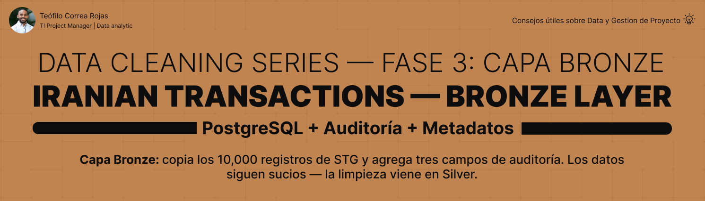

# Iranian Transactions — Bronze Layer



## 📌 Descripción

Tercera fase de una serie de limpieza de datos en PostgreSQL usando el
**Dirty Iranian Transactions Dataset** (Kaggle). Este proyecto crea la
capa Bronze copiando los 10,000 registros de STG y agregando tres campos
de auditoría: `source_file`, `load_date` y `record_status`.

Los datos siguen siendo TEXT y siguen estando sucios. Bronze no limpia
— **registra el origen y el momento de la carga**.

> ℹ️ Dataset sintético de práctica de Kaggle, usado con fines educativos.

---

## 🎯 Objetivos del proyecto

- Crear la tabla Bronze con las 6 columnas de negocio + 3 de auditoría
- Copiar los 10,000 registros de STG a Bronze con INSERT SELECT
- Agregar los metadatos de auditoría en el mismo paso
- Validar que la carga fue completa (COUNT = 10,000)

---

## 🏗️ Contexto — Arquitectura Medallion

```
iranian_transactions_db
│
├── stg → datos crudos ✅
├── bronze ← este proyecto ⭐ (auditoría)
├── silver → limpieza
└── gold → modelo dimensional
```


Bronze es la primera capa de trazabilidad: sabe de dónde vinieron
los datos y cuándo llegaron. STG los preserva; Bronze los registra.

---

## 📋 Sobre la tabla

```
bronze.transactions
→ 6 columnas de negocio (TEXT, igual que STG)
→ 3 columnas de auditoría (NOT NULL)
→ 10,000 registros
→ sin PK (los datos siguen sucios)
```


| Campo | Tipo | Origen |
|---|---|---|
| `status` | TEXT | negocio |
| `transaction_time` | TEXT | negocio |
| `card_type` | TEXT | negocio |
| `city` | TEXT | negocio |
| `amount` | TEXT | negocio |
| `id` | TEXT | negocio |
| `source_file` | VARCHAR(100) NOT NULL | auditoría → 'stg_transactions' |
| `load_date` | TIMESTAMP NOT NULL | auditoría → DEFAULT NOW() |
| `record_status` | VARCHAR(20) NOT NULL | auditoría → 'active' |

---

## 💡 Decisiones clave de esta capa

| Decisión | Razón |
|---|---|
| Sin PK | El id se repite (rango 1-100); una PK fallaría |
| Auditoría NOT NULL | Son metadatos controlados — nunca pueden ser NULL |
| load_date con DEFAULT NOW() | Se autogenera al insertar — no se incluye en el INSERT |
| Datos siguen en TEXT | La limpieza y conversión de tipos ocurre en Silver |
| Datos siguen sucios | Bronze no transforma — solo registra el origen |

---

## ✅ Resultado de la carga

| Métrica | Resultado |
|---|---|
| Registros cargados | 10,000 |
| Pérdida de datos | 0 |
| source_file | 'stg_transactions' en todos |
| record_status | 'active' en todos |

---

## 🧱 Estructura del proyecto

```
IranianTransactions_Bronze_Layer/
│
├── asset/
│ └── banner_bronze.png
│
├── dataset/
│ └── trx-10k.csv
│
├── docs/
│ └── project_closure.md
│
├── sql/
│ └── 02_bronze/
│ ├── 01_create_bronze_transactions.sql
│ ├── 02_insert_bronze.sql
│ ├── 03_validate_bronze.sql
│ └── README.md
│
├── .gitignore
└── README.md
```

---

## 🚀 Cómo usar

```
Ejecutar 01_create_bronze_transactions.sql
→ crear la tabla bronze.transactions
Ejecutar 02_insert_bronze.sql
→ copiar los 10,000 registros de STG
con los 3 campos de auditoría
Ejecutar 03_validate_bronze.sql
→ confirmar COUNT = 10,000
→ verificar auditoría correcta
```

---

## 🔜 Fases del proyecto

| Fase | Proyecto | Enfoque |
|---|---|---|
| 1 | IranianTransactions_Database_Infrastructure | Infraestructura ✅ |
| 2 | IranianTransactions_STG_Layer | Datos crudos ✅ |
| 3 | IranianTransactions_Bronze_Layer | Auditoría ← estás aquí |
| 4 | IranianTransactions_Silver_Layer | Limpieza + columnas calculadas |
| 5 | IranianTransactions_Gold_Layer | Modelo dimensional + window functions |

---

## 👤 Autor

### Teófilo Correa Rojas
**Project Manager TI | Data analytic**
🔗 [LinkedIn](https://www.linkedin.com/in/teófilo-correa-rojas/)